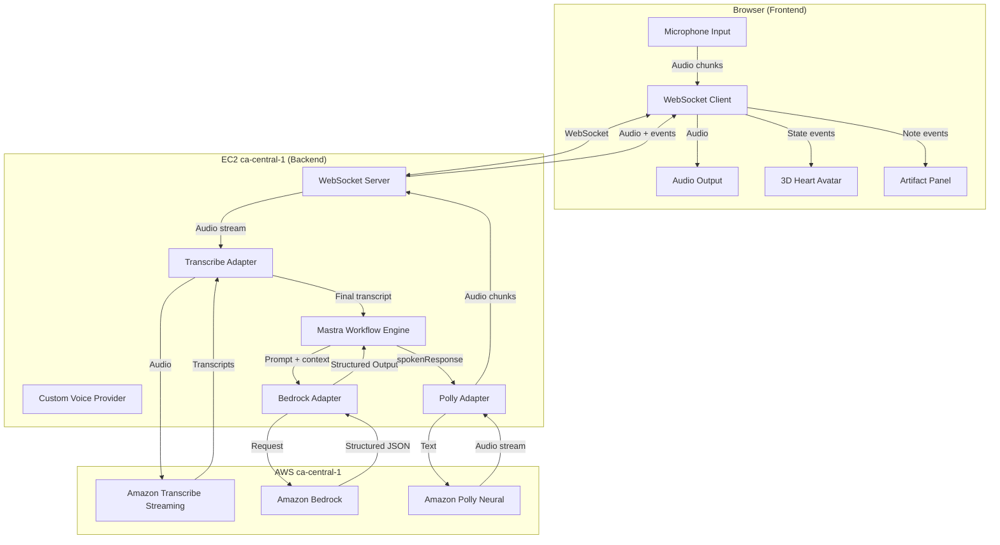

# Design Document: SafeSecrets Voice AI

## Overview

SafeSecrets is a voice-first Valentine's Day assistant built as a full-stack TypeScript application. The backend runs a Mastra-powered workflow engine on an EC2 instance in ca-central-1, exposing a WebSocket server that handles real-time audio streaming, LLM orchestration, and TTS playback. The frontend is a single-page application with a two-panel layout: a 3D animated heart avatar (left) driven by a state machine, and a love-note artifact notepad (right) with refinement controls.

The system uses a streaming voice pipeline: browser microphone audio flows over WebSocket to Amazon Transcribe for STT, transcripts feed into a Mastra workflow that calls Amazon Bedrock for structured LLM responses, and spoken replies are synthesized via Amazon Polly Neural and streamed back to the browser. All AWS services are pinned to ca-central-1 for Canadian data sovereignty.

## Architecture



### Key Architectural Decisions

1. **Single EC2 instance**: Both the WebSocket server and static frontend are served from one EC2 instance in ca-central-1, simplifying deployment and ensuring all traffic stays in-region.

2. **WebSocket over HTTP**: WebSocket is chosen over REST for the primary communication channel because the voice pipeline requires low-latency bidirectional streaming of audio chunks and events.

3. **Deep Mastra SDK integration**: The Mastra SDK (`@mastra/core`) is installed as a core dependency. The system uses:
   - **Mastra Agent**: A configured agent with system prompt, tools, and Amazon Bedrock as the LLM provider
   - **Mastra Workflow** (`createWorkflow` / `createStep`): Multi-step workflow with `collect → compose → refine` stages, using Mastra's built-in step transitions and context passing
   - **Custom Mastra Voice Provider**: Implements Mastra's `MastraVoice` interface to wrap Amazon Transcribe (STT) and Amazon Polly (TTS), enabling Mastra's `agent.voice.listen()` and `agent.voice.speak()` APIs
   - **Mastra Memory**: Uses Mastra's conversation memory to persist session context across workflow stages
   This deep integration means the conversation orchestration, voice pipeline, and LLM calls all flow through Mastra's APIs rather than being custom-built.

4. **Video-based avatar illusion**: Rather than real-time 3D rendering with lip sync, the avatar uses pre-rendered video loops switched by a state machine. This is simpler to implement and performs well across devices.

5. **Structured JSON output contract**: Bedrock responses are constrained to a fixed JSON schema so the backend can deterministically route fields to the correct consumers (UI events, TTS, notepad).

### Mastra SDK Dependencies

```json
{
  "@mastra/core": "latest",
  "@mastra/voice": "latest",
  "@ai-sdk/amazon-bedrock": "latest"
}
```

The Mastra SDK is installed via npm and provides:
- `Agent` class for LLM orchestration with tool use
- `createWorkflow` / `createStep` for defining multi-stage conversation flows
- `MastraVoice` base class for implementing custom voice providers
- Built-in memory management for conversation context persistence
- Integration with Amazon Bedrock via the `@ai-sdk/amazon-bedrock` provider

## Components and Interfaces

### Backend Components

#### 1. WebSocket Server (`ws-server.ts`)
Manages client connections and routes messages between the frontend and backend services.

```typescript
interface WSMessage {
  type: 'audio' | 'control' | 'event';
  payload: AudioChunk | ControlCommand | ServerEvent;
}

interface ControlCommand {
  action: 'start_conversation' | 'end_conversation' | 'refinement';
  data?: RefinementRequest;
}

interface ServerEvent {
  event: 'user_speaking_start' | 'partial_transcript' | 'final_transcript'
       | 'ui.style' | 'ui.noteDraft' | 'tts.start' | 'tts.end'
       | 'error' | 'session_ready';
  data: unknown;
}

interface AudioChunk {
  data: Buffer;
  sampleRate: number;
  encoding: 'pcm';
}
```

Responsibilities:
- Accept WebSocket connections on `/ws`
- Create a session context per connection (Transcribe stream, Mastra session, Polly stream)
- Route incoming audio to the Transcribe adapter
- Forward backend events to the connected client
- Clean up all resources on disconnect (graceful or unexpected)

#### 2. Transcribe Adapter (`transcribe-adapter.ts`)
Wraps Amazon Transcribe Streaming SDK for real-time STT.

```typescript
interface TranscribeAdapter {
  startStream(sessionId: string, onPartial: (text: string) => void, onFinal: (text: string) => void): Promise<void>;
  feedAudio(sessionId: string, chunk: AudioChunk): void;
  stopStream(sessionId: string): Promise<void>;
}
```

Responsibilities:
- Open a Transcribe streaming session pinned to ca-central-1
- Accept PCM audio chunks and feed them to the Transcribe stream
- Emit partial and final transcript callbacks
- Handle Transcribe errors and propagate them

#### 3. Bedrock Adapter (`bedrock-adapter.ts`)
Wraps Amazon Bedrock for LLM inference with structured output.

```typescript
interface BedrockAdapter {
  generateStructuredResponse(prompt: string, context: ConversationContext): Promise<StructuredOutput>;
}

interface StructuredOutput {
  style: 'soft' | 'flirty' | 'serious';
  spokenResponse: string;
  noteDraft: string;
  tags: string[];
}
```

Responsibilities:
- Send prompts to Bedrock in ca-central-1 with the structured output JSON schema
- Parse and validate the response against the StructuredOutput schema
- Retry once on invalid/unparseable responses
- Throw typed errors on continued failure

#### 4. Polly Adapter (`polly-adapter.ts`)
Wraps Amazon Polly Neural for streaming TTS.

```typescript
interface PollyAdapter {
  synthesize(text: string, onAudioChunk: (chunk: Buffer) => void): Promise<void>;
  stop(): void;
}
```

Responsibilities:
- Call Polly Neural in ca-central-1 with the spokenResponse text
- Stream audio chunks back via callback
- Support immediate cancellation for barge-in scenarios

#### 5. Mastra Workflow Engine (`mastra-workflow.ts`)
Orchestrates the multi-stage conversation flow using Mastra SDK's `createWorkflow` and `createStep` APIs.

```typescript
import { Agent } from '@mastra/core/agent';
import { createWorkflow, createStep } from '@mastra/core/workflows';
import { AmazonBedrockProvider } from '@ai-sdk/amazon-bedrock';

// Bedrock provider pinned to ca-central-1
const bedrockProvider = new AmazonBedrockProvider({ region: 'ca-central-1' });

// Mastra Agent with Valentine assistant system prompt
const valentineAgent = new Agent({
  name: 'SafeSecrets',
  model: bedrockProvider('<model-id>'),
  instructions: `You are a warm, creative Valentine's Day assistant...`,
  voice: customVoiceProvider, // Custom voice provider wrapping Transcribe + Polly
});

// Workflow steps using Mastra's createStep API
const collectStep = createStep({ id: 'collect', /* ... */ });
const composeStep = createStep({ id: 'compose', /* ... */ });
const refineStep = createStep({ id: 'refine', /* ... */ });

const valentineWorkflow = createWorkflow({
  name: 'valentine-note',
  steps: [collectStep, composeStep, refineStep],
});

interface ConversationContext {
  recipient: string | null;
  situation: string | null;
  desiredTone: string | null;
  desiredOutcome: string | null;
  currentDraft: string | null;
  conversationHistory: Message[];
}

interface Message {
  role: 'user' | 'assistant';
  content: string;
}

type WorkflowStage = 'collect' | 'compose' | 'refine';

interface WorkflowResult {
  structuredOutput?: StructuredOutput;
  spokenResponse: string;
  stage: WorkflowStage;
}

interface RefinementRequest {
  type: 'shorter' | 'bolder' | 'more_romantic' | 'translate_french';
}
```

Responsibilities:
- Initialize the Mastra Agent with Bedrock provider and custom voice provider
- Define workflow steps using `createStep` for collect, compose, and refine stages
- Wire steps together using `createWorkflow` with Mastra's step transition API
- Use Mastra's memory to persist per-session conversation context across steps
- In "collect" stage: use the agent to analyze transcript and extract context fields, generate clarifying questions
- In "compose" stage: use the agent with structured output to generate the love note via Bedrock
- In "refine" stage: use the agent to update only the noteDraft while preserving context
- Emit events (ui.style, ui.noteDraft) through the WebSocket server

#### 6. Custom Mastra Voice Provider (`custom-voice-provider.ts`)
Implements Mastra's `MastraVoice` interface to wrap Amazon Transcribe (STT) and Amazon Polly (TTS).

```typescript
import { MastraVoice } from '@mastra/voice';

class SafeSecretsVoiceProvider extends MastraVoice {
  private transcribeAdapter: TranscribeAdapter;
  private pollyAdapter: PollyAdapter;

  // Mastra calls this for STT
  async listen(audioStream: ReadableStream): Promise<string> {
    // Streams audio to Transcribe in ca-central-1
    // Returns final transcript
  }

  // Mastra calls this for TTS
  async speak(text: string): Promise<ReadableStream> {
    // Sends text to Polly Neural in ca-central-1
    // Returns audio stream
  }
}
```

Responsibilities:
- Implement `listen()` to stream audio to Amazon Transcribe and return transcripts
- Implement `speak()` to synthesize speech via Amazon Polly Neural and return audio stream
- Ensure both services are pinned to ca-central-1
- Support cancellation for barge-in scenarios

### Frontend Components

#### 7. WebSocket Client (`ws-client.ts`)
Manages the browser-side WebSocket connection.

```typescript
interface WSClientEvents {
  onSessionReady: () => void;
  onPartialTranscript: (text: string) => void;
  onFinalTranscript: (text: string) => void;
  onStyleUpdate: (style: 'soft' | 'flirty' | 'serious') => void;
  onNoteDraftUpdate: (draft: string, tags: string[]) => void;
  onTTSStart: () => void;
  onTTSEnd: () => void;
  onAudioChunk: (chunk: ArrayBuffer) => void;
  onError: (error: string) => void;
}
```

#### 8. Avatar State Machine (`avatar-state-machine.ts`)

```typescript
type AvatarState = 'idle' | 'listening' | 'thinking' | 'speaking';
type SpeakingStyle = 'soft' | 'flirty' | 'serious';

interface AvatarStateMachine {
  currentState: AvatarState;
  currentStyle: SpeakingStyle;
  transition(event: AvatarEvent): AvatarState;
  getVideoSource(): string;
}

type AvatarEvent =
  | { type: 'USER_SPEAKING_START' }
  | { type: 'USER_SPEAKING_END' }
  | { type: 'TTS_START'; style: SpeakingStyle }
  | { type: 'TTS_END' }
  | { type: 'THINKING_START' }
  | { type: 'THINKING_END' };
```

State transition rules (priority: listening > speaking > thinking > idle):
- `USER_SPEAKING_START` → always transitions to `listening` (highest priority)
- `TTS_START` → transitions to `speaking` only if not in `listening`
- `THINKING_START` → transitions to `thinking` only if not in `listening` or `speaking`
- `TTS_END` → transitions to `idle` if not in `listening` or `thinking`
- `USER_SPEAKING_END` → transitions to `speaking` if TTS active, `thinking` if processing, else `idle`

#### 9. Artifact Panel Component (`artifact-panel.tsx`)
React component for the love note notepad.

```typescript
interface ArtifactPanelProps {
  noteDraft: string;
  tags: string[];
  toneLabel: 'soft' | 'flirty' | 'serious' | null;
  onRefinement: (type: RefinementRequest['type']) => void;
  onCopy: () => void;
}
```

#### 10. Audio Manager (`audio-manager.ts`)
Handles browser microphone capture and audio playback.

```typescript
interface AudioManager {
  startCapture(onChunk: (chunk: ArrayBuffer) => void): Promise<void>;
  stopCapture(): void;
  playAudioChunk(chunk: ArrayBuffer): void;
  stopPlayback(): void;
  isPlaying(): boolean;
}
```

## Data Models

### WebSocket Event Schema

All messages between frontend and backend follow this envelope:

```typescript
// Client → Server
type ClientMessage =
  | { type: 'audio'; payload: { data: ArrayBuffer; sampleRate: number } }
  | { type: 'control'; payload: { action: 'start_conversation' } }
  | { type: 'control'; payload: { action: 'end_conversation' } }
  | { type: 'control'; payload: { action: 'refinement'; data: RefinementRequest } };

// Server → Client
type ServerMessage =
  | { type: 'event'; event: 'session_ready' }
  | { type: 'event'; event: 'user_speaking_start' }
  | { type: 'event'; event: 'partial_transcript'; data: { text: string } }
  | { type: 'event'; event: 'final_transcript'; data: { text: string } }
  | { type: 'event'; event: 'ui.style'; data: { style: 'soft' | 'flirty' | 'serious' } }
  | { type: 'event'; event: 'ui.noteDraft'; data: { noteDraft: string; tags: string[] } }
  | { type: 'event'; event: 'tts.start' }
  | { type: 'event'; event: 'tts.end' }
  | { type: 'audio'; payload: { data: ArrayBuffer } }
  | { type: 'event'; event: 'error'; data: { message: string } };
```

### Structured Output Schema

```typescript
interface StructuredOutput {
  style: 'soft' | 'flirty' | 'serious';
  spokenResponse: string;
  noteDraft: string;
  tags: string[];
}

// JSON Schema for Bedrock prompt enforcement
const structuredOutputSchema = {
  type: 'object',
  required: ['style', 'spokenResponse', 'noteDraft', 'tags'],
  properties: {
    style: { type: 'string', enum: ['soft', 'flirty', 'serious'] },
    spokenResponse: { type: 'string', minLength: 1 },
    noteDraft: { type: 'string', minLength: 1 },
    tags: { type: 'array', items: { type: 'string' } }
  },
  additionalProperties: false
};
```

### Conversation Context Model

```typescript
interface ConversationContext {
  sessionId: string;
  stage: WorkflowStage;
  recipient: string | null;
  situation: string | null;
  desiredTone: string | null;
  desiredOutcome: string | null;
  currentDraft: string | null;
  currentTags: string[];
  currentStyle: 'soft' | 'flirty' | 'serious' | null;
  conversationHistory: Message[];
  createdAt: Date;
}
```

### Session Resource Tracking

```typescript
interface SessionResources {
  sessionId: string;
  wsConnection: WebSocket;
  transcribeStream: TranscribeStream | null;
  mastraSession: ConversationContext;
  pollyStream: PollyStream | null;
  isActive: boolean;
}
```

## Correctness Properties

*A property is a characteristic or behavior that should hold true across all valid executions of a system — essentially, a formal statement about what the system should do. Properties serve as the bridge between human-readable specifications and machine-verifiable correctness guarantees.*

### Property 1: Avatar state machine priority invariant

*For any* sequence of avatar events, the Avatar_State_Machine SHALL always resolve to the highest-priority active state according to the order: listening > speaking > thinking > idle. Specifically, if a USER_SPEAKING_START event has been received without a corresponding USER_SPEAKING_END, the state SHALL be `listening` regardless of any other events received.

**Validates: Requirements 4.5, 5.1, 5.2, 5.3, 5.5, 5.6**

### Property 2: Speaking style selects correct video source

*For any* valid style value ("soft", "flirty", or "serious") received in a TTS_START event, the Avatar_State_Machine SHALL return the corresponding video source path for that style variant.

**Validates: Requirements 5.4**

### Property 3: New sessions start in collect stage

*For any* newly initialized Mastra session, the workflow stage SHALL be "collect" and the conversation context fields (recipient, situation, desiredTone, desiredOutcome) SHALL all be null.

**Validates: Requirements 3.1**

### Property 4: Complete context triggers compose transition

*For any* conversation context where all four required fields (recipient, situation, desiredTone, desiredOutcome) are non-null, processing the next transcript SHALL transition the workflow to the "compose" stage.

**Validates: Requirements 3.2**

### Property 5: Structured output validation

*For any* JSON object, the StructuredOutput validator SHALL accept it if and only if it contains a `style` field with value "soft", "flirty", or "serious", a non-empty `spokenResponse` string, a non-empty `noteDraft` string, and a `tags` array of strings. Invalid objects SHALL be rejected.

**Validates: Requirements 3.3, 7.2, 7.3, 7.4, 7.5, 7.6**

### Property 6: Structured output routes to correct events

*For any* valid StructuredOutput, the Mastra_Workflow SHALL emit exactly one `ui.style` event with the style value, exactly one `ui.noteDraft` event with the noteDraft and tags, and send the spokenResponse to the Polly_Client.

**Validates: Requirements 3.4**

### Property 7: Refinement preserves non-draft context

*For any* conversation context in the "compose" or "refine" stage and any refinement request, after processing the refinement, the context fields (recipient, situation, desiredTone, desiredOutcome, conversationHistory) SHALL remain unchanged. Only the noteDraft, tags, and currentStyle fields may change.

**Validates: Requirements 3.5**

### Property 8: Artifact panel renders all structured output fields

*For any* StructuredOutput with a non-empty noteDraft, a non-empty tags array, and a valid style, the Artifact_Panel SHALL render the noteDraft text, all tags, and the tone label in its output.

**Validates: Requirements 6.1, 6.2, 6.3**

### Property 9: Refinement buttons map to correct request types

*For any* refinement button click ("Make it shorter", "Make it bolder", "Make it more romantic", "Translate to French"), the Artifact_Panel SHALL emit a RefinementRequest with the corresponding type value ("shorter", "bolder", "more_romantic", "translate_french").

**Validates: Requirements 6.5**

### Property 10: Backend events forwarded to client

*For any* ServerEvent produced by the backend (ui.style, ui.noteDraft, tts.start, tts.end, partial_transcript, final_transcript), the WebSocket_Server SHALL emit that event to the connected frontend client with the original data payload intact.

**Validates: Requirements 1.3**

## Error Handling

### WebSocket Connection Errors
- **Unexpected disconnect**: The server detects closed connections via WebSocket `close` event. On disconnect, all session resources (Transcribe stream, Polly stream, Mastra session) are cleaned up immediately. The session is removed from the active sessions map.
- **Connection timeout**: If no audio or control messages are received for 5 minutes, the server closes the connection and cleans up resources.

### Transcribe Errors
- **Stream failure**: If the Transcribe stream emits an error, the adapter logs the error, emits an `error` event to the frontend with a user-friendly message, and attempts to restart the stream.
- **Audio format issues**: If audio chunks are in an unexpected format, the adapter rejects them silently and logs a warning.

### Bedrock Errors
- **Invalid response**: If Bedrock returns a response that doesn't conform to the StructuredOutput schema, the workflow retries once with the same prompt. On second failure, it emits a spoken error message ("I'm having trouble composing right now, let me try again") and logs the invalid response.
- **Timeout/unavailability**: If Bedrock doesn't respond within 30 seconds, the workflow times out and notifies the user via spoken message.

### Polly Errors
- **Synthesis failure**: If Polly fails to synthesize speech, the system logs the error and emits a `tts.end` event so the avatar state machine doesn't get stuck in the speaking state. The text response is displayed in the artifact panel as a fallback.

### Barge-in Handling
- When the user starts speaking during TTS playback, the Polly adapter immediately stops synthesis, the WebSocket server emits `tts.end`, and the avatar transitions to `listening`. Any buffered audio is discarded.

### Region Fallback Prevention
- All AWS client constructors explicitly set `region: 'ca-central-1'`. No fallback regions are configured. If a service is unavailable, the error propagates to the user rather than silently routing to another region.

## Testing Strategy

### Testing Framework
- **Unit tests**: Vitest for both frontend and backend TypeScript code
- **Property-based tests**: fast-check library with Vitest integration
- **Component tests**: React Testing Library for frontend components

### Property-Based Testing Configuration
- Each property test runs a minimum of 100 iterations
- Each test is tagged with: `Feature: valentines-voice-ai, Property {N}: {title}`
- fast-check arbitraries are used to generate random events, structured outputs, and conversation contexts

### Unit Test Focus Areas
- Avatar state machine transitions for specific event sequences
- Structured output validation with known valid/invalid JSON examples
- WebSocket message serialization/deserialization
- Refinement button click handlers
- Error handling paths (Transcribe failure, Bedrock invalid response, Polly failure)
- Session cleanup on disconnect
- AWS region configuration verification

### Property Test Focus Areas
- Property 1: Generate random sequences of AvatarEvents, apply them to the state machine, verify priority invariant holds after each event
- Property 2: Generate random style values from the valid set, verify correct video source mapping
- Property 3: Generate random session IDs, verify initial state
- Property 4: Generate random ConversationContext objects with all fields filled, verify compose transition
- Property 5: Generate random JSON objects (both valid and invalid), verify validation accepts/rejects correctly
- Property 6: Generate random valid StructuredOutputs, verify correct events are emitted
- Property 7: Generate random contexts and refinement requests, verify non-draft fields are unchanged
- Property 8: Generate random StructuredOutputs, render the ArtifactPanel, verify all fields appear in output
- Property 9: Generate random refinement button types, verify correct request type mapping
- Property 10: Generate random ServerEvents, verify they are forwarded with data intact

### Integration Test Focus Areas
- Full conversation flow: start → collect → compose → refine → end
- Barge-in during TTS playback
- WebSocket connection lifecycle (connect, disconnect, reconnect)
- Error recovery paths
